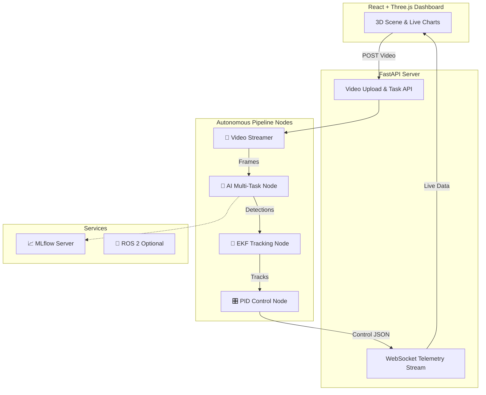

<div align="center">

# 🚗 AI-First Autonomous Perception & Control System

**A Full-Stack, Containerized, Closed-Loop Autonomous Driving Pipeline**

[](https://www.python.org/)
[](https://fastapi.tiangolo.com/)
[](https://reactjs.org/)
[](https://threejs.org/)
[](https://www.docker.com/)
[](https://docs.ros.org/)
[](https://opensource.org/licenses/MIT)

</div>

---

## 🌟 Overview

Welcome to the **AI-First Autonomous Perception & Control System**. This project transforms raw dashboard driving video into a **live, interactive 3D spatial simulation**. 

It features a custom multi-task deep learning model, Extended Kalman smoothing, PID-based adaptive cruise control, a ROS 2 robotic backbone, and a stunning React + Three.js telemetry dashboard. Everything is beautifully orchestrated via Docker.

### ✨ Key Features
- **🧠 Multi-Task AI Perception**: A unified ONNX model (ResNet-18/YOLOv5) for object detection, classification, and continuous distance regression.
- **🎯 Robust Tracking**: Extended Kalman Filter (EKF) tracking to smooth frame-to-frame AI noise and calculate closing velocities.
- **⚙️ Adaptive Cruise Control (ACC)**: A discrete PID controller with anti-windup clamping to maintain safe following distances.
- **🌐 3D Telemetry Dashboard**: A React + Three.js frontend providing a chase-cam 3D world view, bird's eye view, and live data charts.
- **🐳 One-Click Docker Deployment**: Seamlessly orchestrated environment using Docker Compose.
- **📊 MLflow Tracking**: Built-in experiment tracking for model metrics and ONNX artifacts.

---

## 🏗️ System Architecture



---

## 📂 Repository Layout

```text
ai-perception/
├── backend/          # FastAPI server handling uploads, pipeline orchestration, and WebSockets
├── frontend/         # React, Vite, Three.js, and Recharts interactive 3D dashboard
├── ml/               # Model definitions, dataset loaders, training scripts, and ONNX export
├── pipeline/         # Pure-Python pipeline simulation nodes (VideoStreamer, AI, Kalman, PID)
├── ros2_ws/          # Real ROS 2 nodes, custom messages, and launch files
├── scripts/          # Utility scripts for training and demo generation
├── data/             # Datasets and auto-generated sample driving videos
├── docker-compose.yml# Multi-container orchestration (Frontend, Backend, MLflow)
└── start_all.ps1     # One-click Windows PowerShell deployment script
```

---

## 🚀 Getting Started (Docker Mode)

The easiest way to run the entire project—complete with the 3D dashboard, FastAPI backend, and MLflow tracking—is using Docker.

### Prerequisites
- Docker & Docker Compose
- Windows PowerShell (for the unified startup script)

### 1. Launch the Stack
Run the unified orchestrator script from the project root:

```powershell
.\start_all.ps1
```

This will spin up:
- **Frontend Dashboard**: `http://localhost:5173`
- **Backend API**: `http://localhost:8000`
- **MLflow UI**: `http://localhost:5000`

### 2. Run the Pipeline
1. Open the **Frontend Dashboard** in your browser.
2. Click **Upload Video** and select the provided `data/sample/drive.mp4` (or any custom dashcam footage).
3. Watch the **3D World View** come alive as the AI processes frames, the Kalman filter tracks objects, and the PID controller adjusts simulated speed in real-time!

---

## 🧠 Deep Dive: Pipeline Nodes

The system operates on a lightweight, pub/sub message bus (replacing ROS topics for the pure-Python simulation) passing data through four critical nodes:

1. **`VideoStreamerNode`**: Reads the video file, maintains the target FPS, and publishes raw BGR frames.
2. **`AINode`**: Loads the optimized ONNX model (FP16/INT8). Performs a single forward pass to extract 2D bounding boxes, class labels, and metric depth distances.
3. **`KalmanNode`**: Applies an Extended Kalman Filter (EKF) to raw detections. It tracks objects across frames, smoothing noisy AI distances and estimating lateral/longitudinal velocities.
4. **`PIDNode`**: Selects the closest in-lane lead vehicle and applies a proportional-integral-derivative algorithm to calculate the optimal throttle/brake response to maintain a safe target setpoint.

---

## 🤖 Real ROS 2 Integration

For deployment to physical hardware, the Python pipeline is designed to be 1:1 compatible with ROS 2 (Humble/Jazzy).

```bash
# 1. Build the ROS 2 workspace
cd ros2_ws
colcon build
source install/setup.bash

# 2. Launch the autonomous perception stack
ros2 launch autonomous_perception full_stack.launch.py video_path:=/path/to/video.mp4 onnx_path:=/path/to/model.onnx

# 3. Launch the Rosbridge WebSocket server (for frontend communication)
ros2 launch autonomous_perception rosbridge.launch.py
```

---

## 🔬 Model Training & MLflow

We utilize **Huber Loss** for depth regression to heavily penalize close-range errors (which are safety-critical) while remaining stable for distant objects.

To train the model on your own dataset (e.g., Udacity Self-Driving Car Dataset):

```bash
# Train the model and export to INT8 ONNX
bash scripts/train_real.sh /path/to/udacity-dataset
```

View your training metrics, loss curves, and artifact models locally via the included MLflow server at `http://localhost:5000`.

---

## 📐 Configuration

Tune the pipeline's behavior without changing code:
- **AI/Model Params**: `ml/configs/default.yaml` (confidence thresholds, NMS IoU, opset versions).
- **Control Params**: Adjust PID gains (`kp`, `ki`, `kd`) and lateral tracking limits directly in `pipeline/nodes/pid_node.py` or via environment variables in `backend/services/config.py`.

---

## 📄 License

This project is licensed under the **MIT License**. Feel free to use, modify, and distribute it for both educational and commercial purposes.
